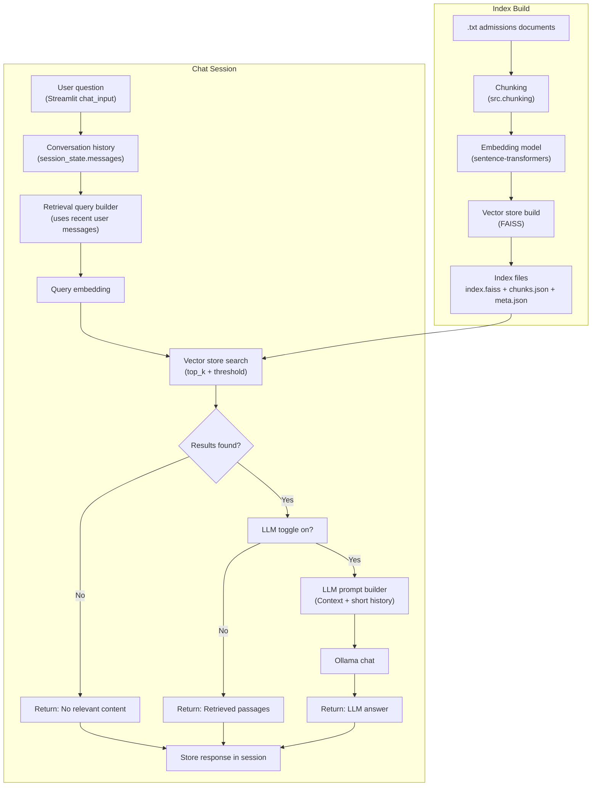

# LU Admissions Chatbot Flowchart

```mermaid
flowchart TD
  %% -------------------------
  %% Index build (offline)
  %% -------------------------
  subgraph A[Index Build]
    A1[.txt admissions documents]
    A2["Chunking<br/>(src.chunking)"]
    A3["Embedding model<br/>(sentence-transformers)"]
    A4["Vector store build<br/>(FAISS)"]
    A5["Index files<br/>index.faiss + chunks.json + meta.json"]

    A1 --> A2 --> A3 --> A4 --> A5
  end

  %% -------------------------
  %% Chat flow (online)
  %% -------------------------
  subgraph B[Chat Session]
    B1["User question<br/>(Streamlit chat_input)"]
    B2["Conversation history<br/>(session_state.messages)"]
    B3["Retrieval query builder<br/>(uses recent user messages)"]
    B4[Query embedding]
    B5["Vector store search<br/>(top_k + threshold)"]
    B6{Results found?}
    B7[Return: No relevant content]
    B8[LLM toggle on?]
    B9["LLM prompt builder<br/>(Context + short history)"]
    B10[Ollama chat]
    B11[Return: LLM answer]
    B12[Return: Retrieved passages]
    B13[Store response in session]

    B1 --> B2 --> B3 --> B4 --> B5 --> B6
    B6 -- No --> B7 --> B13
    B6 -- Yes --> B8
    B8 -- No --> B12 --> B13
    B8 -- Yes --> B9 --> B10 --> B11 --> B13
  end

  %% -------------------------
  %% Link between build and chat
  %% -------------------------
  A5 --> B5
```
